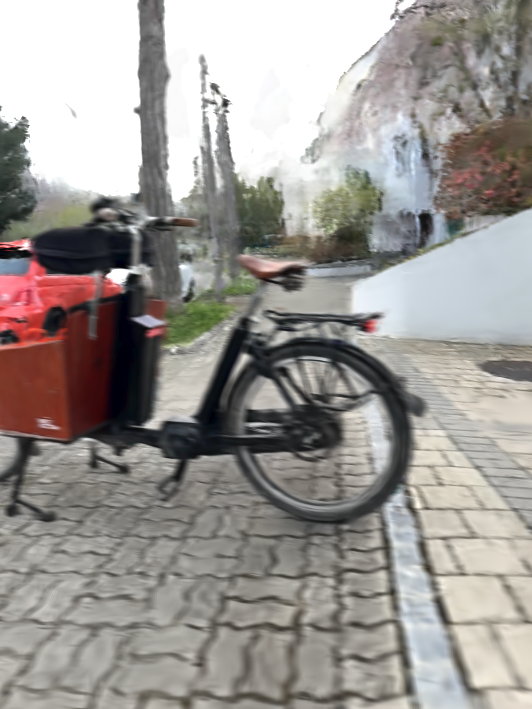
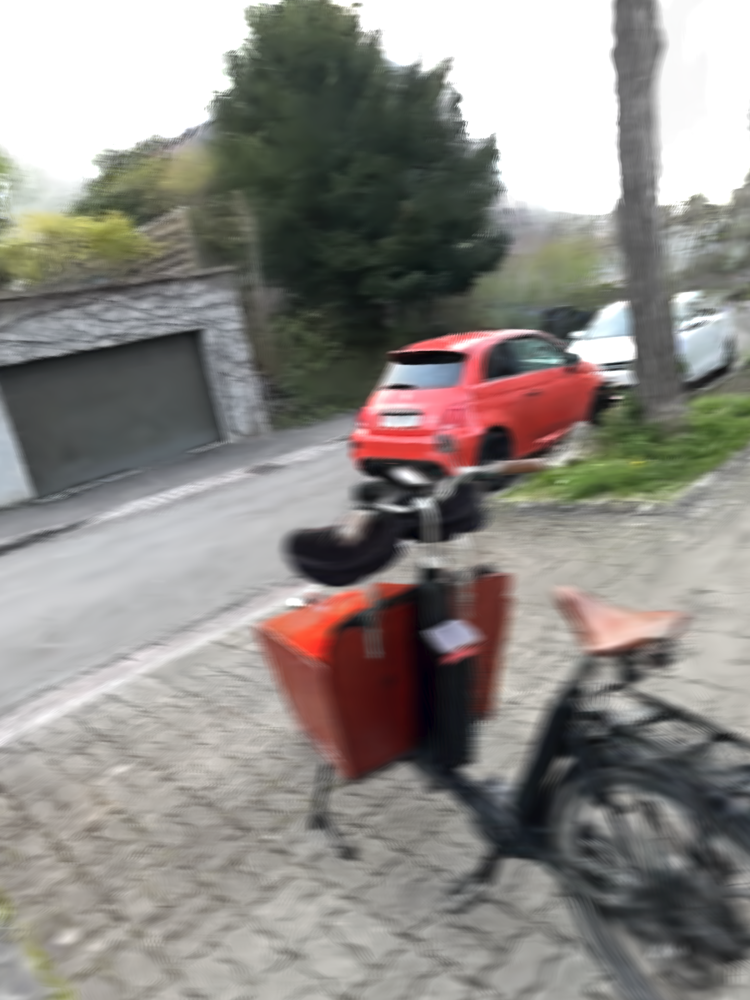

### 3D Gaussian Splatting on the Move Reimplementation Using the INRIA Gaussian Splatting Code

This repository aims to reproduce the deblurring effect described in the "Gaussian Splatting on the Move" [paper](https://arxiv.org/pdf/2403.13327.pdf), based on the original 3D Gaussian Splatting (3DGS) implementation. The reference implementation can be found [here](https://github.com/SpectacularAI/3dgs-deblur/), which uses `splatfacto` as underlying 3DGS implementation. This project serves as an educational tool for me.

I have prepared some data with my iPhone 15 Pro that can be used directly.

Currently, I am unable to reproduce the desired effect. It is unclear whether the rasterizer extension is buggy or if there is an issue with the coordinates in the data. The implementation also runs very slowly. Furthermore, as the rasterizer performs several iterations in both the forward and backward passes, it seems to crash the SIBR remote viewer since everything is processed in a single thread. Therefore, I am writing the rasterizer images to disk.

The original data I am using can be found here: [Original Data](https://drive.google.com/file/d/1mFxMG2Zd7POtrvPu0ASttgoeh_e6oSYS/view?usp=sharing).

The data processed with the SAI API can be found here and is ready to be used with this repository for training: [Processed Data](https://drive.google.com/file/d/1QghmW24Zyb-f2Q6pYMC4qk1OVOwmJ6YP/view?usp=sharing). This is not the input used for `splatfacto`. This data is in Colmap format, converted from TXT to BIN. The poses are slightly worse than one might expect from Colmap. It is clear that the output is significantly worse than the baseline, which was run with `exposure_time = 0` and `blur_samples = 1`.

To clone the code run: 
`
git clone --recursive git@github.com:MrNeRF/gs-on-the-move
`

To install the code, you should be able to use conda, mamba or micromambe. I use this with a proper CUDA 12.1 installation on a Ubunut 22.4 system. To install the code, run e.g.:

`
micromamba create -f environment.yml -y
`

I recommend to unpack the training data into the data folder and start the training code like this:

`
python train.py -s data/cargo -r 2
`

Here are some examples of the current output which are quite blurry:

